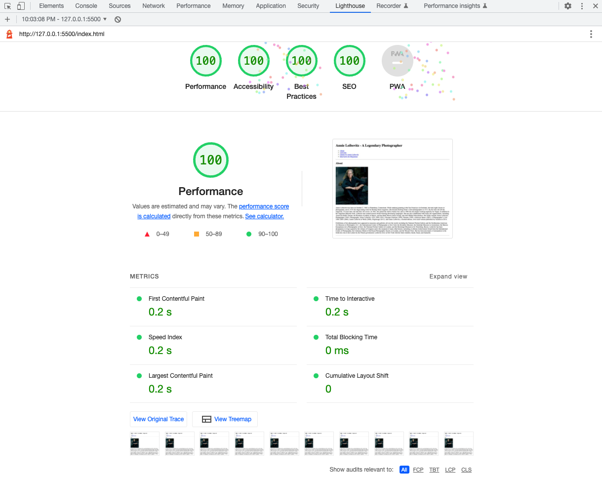
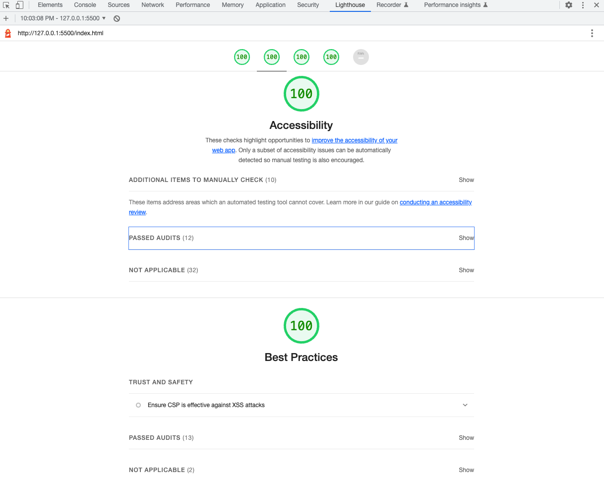
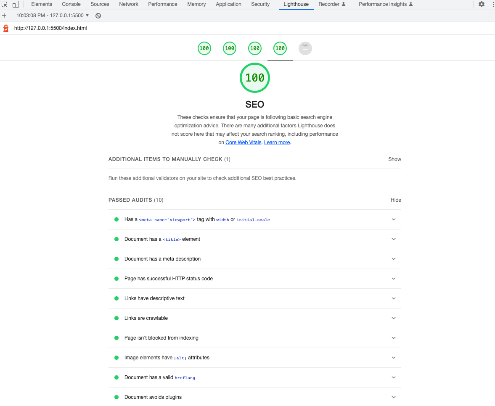

# Assignment 3
## Images

## Links
* [Name of the link](web address)

## Stumbling Blocks
I did't really understand if I can include *article* tag in a *section*, but I'd assume if info can excists on their own I should do it (all the time?).

Can *aside* tag be inside *article* too? I didn't add it, because I feel like the information can excists on their own but it's more specific for the page.

I added *em* tag to add italic style, but I didn't know if I should do it to every paragraph, so I just did one tag for all blocks of texts (not sure if it's correct thing to do).

Didn't know what information should be in the footer, so I just added *back to the top* link and mentioned that I took the infor and images from the web, hope it was enpugh.

It looks like some of my browsers extentions affected my performance number and ni matter what I did, it didn't go higher. I opened my web page in incognito mode, and it gave me 100 right away. I'm curious why is it this way?

Also there is no rating for PWA, is it correct? 